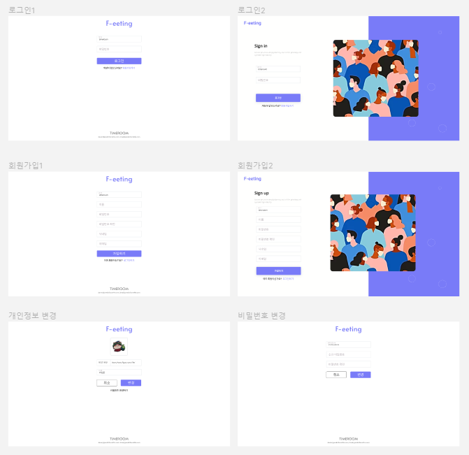
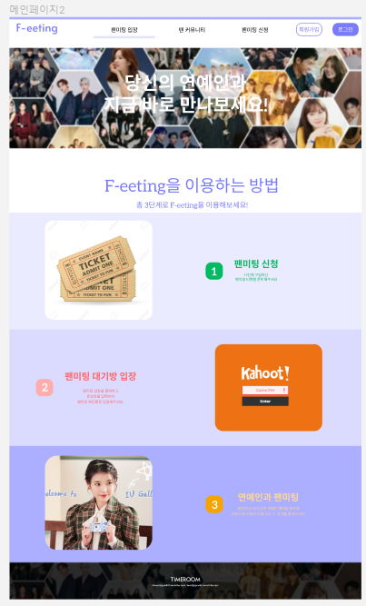
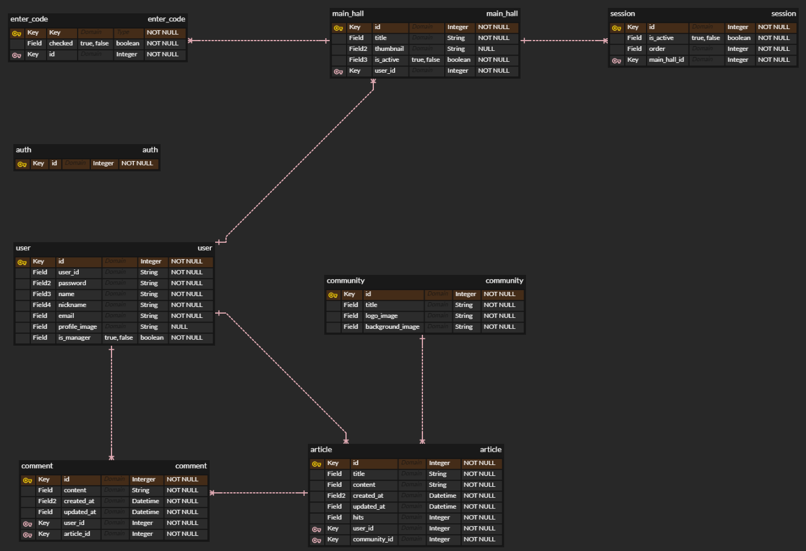
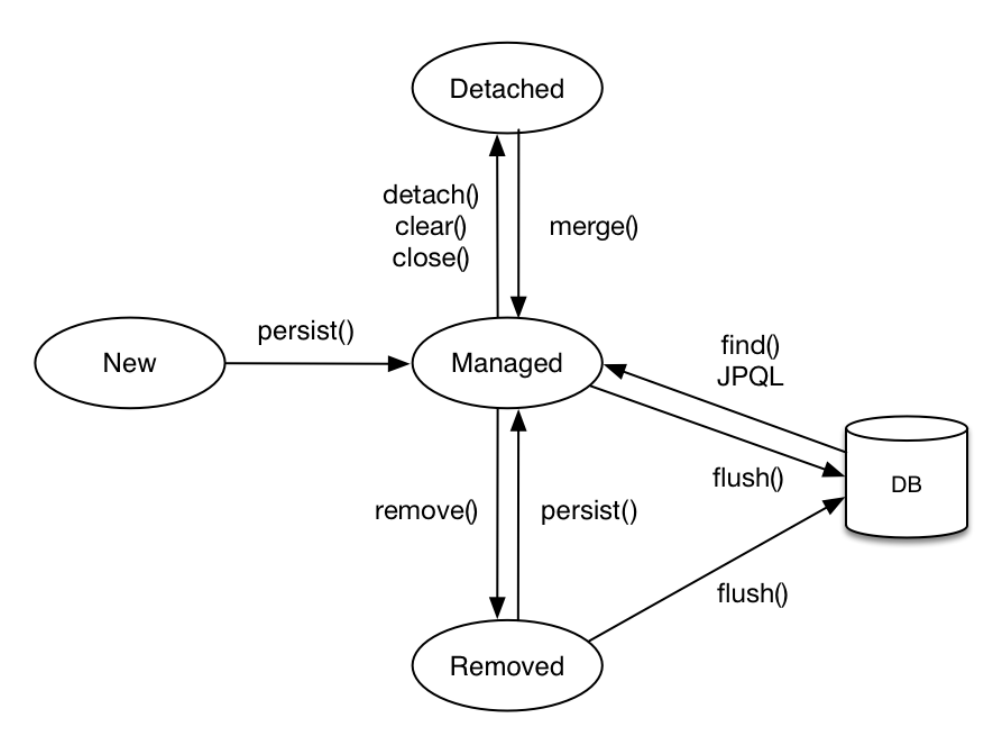

# Sub PJT 1

## 프로젝트 기획 브레인 스토밍

```
- 화상미팅화면
    - 화상카메라 영상송출
    - 카메라 on/off
    - 마이크 on/off
    - 채팅기능
    - 시간 제한 기능
    - 호스트가 임의로 시간을 조절할 수 있는지(1분정도)
- 대기화면
    - 영상재생
    - 광고송출(후순위)
    - 팬들끼리 놀고있을만한 미니게임(?)
- 팬미팅 신청 페이지
    - 선착순 / 랜덤 방식
- 개인 프로필 페이지
    - 신청 내역 확인
    - 신청 내역 변경 / 삭제
```


## UI 설계 회원관리




## UI 설계 메인페이지 보강




## ERD 설계




## JPA 학습

### JPA에서 가장 중요한 2가지

- 객체와 관계형 데이터베이스 매핑하기
- 영속성 컨텍스트


### 영속성 컨텍스트

- JPA를 이해하는데 가장 중요한 용어
- 엔티티를 영구 저장하는 환경이라는 뜻
- EntityManager.persist(entity);
- 영속성 컨텍스트는 논리적인 개념
- 눈에 보이지 않는다.
- 엔티티 매니저를 통해서 영속성 컨텍스트에 접근


### 엔티티의 생명주기

- 비영속
  - 영속성 컨텍스트와 전혀 관계가 없는 새로운 상태
- 영속
  - 영속성 컨텍스트에 관리되는 상태
- 준영속
  - 영속성 컨텍스트에 저장되었다가 분리된 상태
- 삭제
  - 삭제된 상태




### 영속성 컨텍스트의 이점

- 1차 캐시
- 동일성 보장
- 트랜잭션을 지원하는 쓰기 지연
- 변경 감지
- 지연 로딩


### 플러시

- 영속성 컨텍스트의 변경내용을 데이터베이스에 반영


### 플러시 발생

- 변경 감지
- 수정된 엔티티 쓰기 지연 SQL 저장소에 등록
- 쓰기 지연 SQL 저장소의 쿼리를 데이터베이스에 전송(등록, 수정, 삭제 쿼리)


### 영속성 컨텍스트를 플러시하는 방법

- em.flush() - 직접 호출
- 트랜잭션 커밋 - 플러시 자동 호출
- JPQL 쿼리 실행 - 플러시 자동 호출


### 플러시 모드 옵션

- FlushModeType.AUTO - 커밋이나 쿼리를 실행할 때 플러시
- FlushModeType.COMMIT - 커밋할 때만 플러시


### 플러시는

- 영속성 컨텍스트를 비우지 않음
- 영속성 컨텍스트의 변경내용을 데이터베이스에 동기화
- 트랜잭션이라는 작업 단위가 중요 -> 커밋 직전에만 동기화 하면 됨


### 준영속 상태

- 영속 -> 준영속
- 영속 상태의 엔티티가 영속성 컨텍스트에서 분리
- 영속성 컨텍스트가 제공하는 기능을 사용 못함


### 준영속 상태로 만드는 방법

- em.detach(entity) - 특정 엔티티만 준영속 상태로 전환
- em.clear() - 영속성 컨텍스트를 완전히 초기화
- em.close() - 영속성 컨텍스트를 종료
