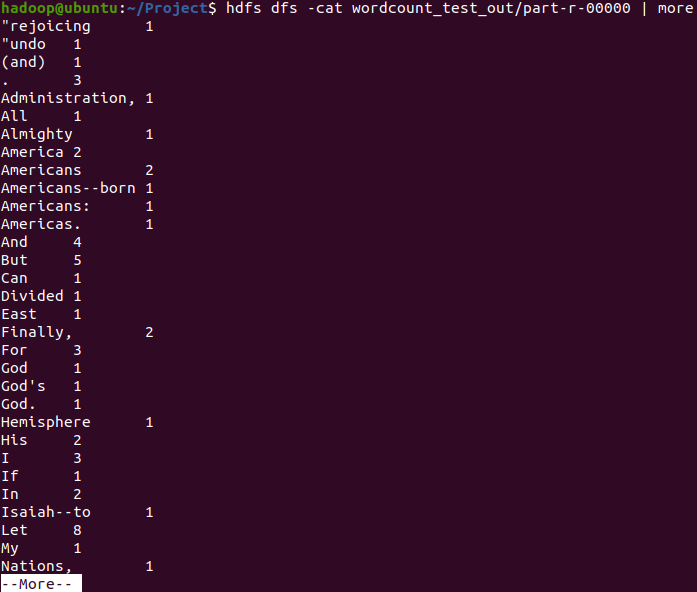
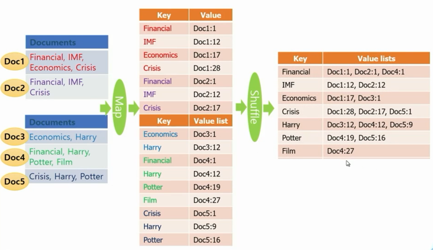

# 2강

### Partitioner Class 변경

Map 함수의 출력인 (key, value) 쌍이 key에 의해서 어느 Reducer(머신)으로 보내질 것인지를 정해지는데, 이러한 결정을 정의하는 Class

하둡의 기본 타입은 Hash 함수가 Default로 제공되고 있어서 key에 대한 해시 값에 따라 어느 Reducer로 보낼지를 결정한다.

- 하둡의 기본 타입
  - Text
  - IntWritable
  - LongWritable
  - FloatWritable
  - DoubleWritable

### wordcountsort 결과

### Inverted Index

### Inverted Index 결과

### Matrix addition

### Matrix addition 결과

