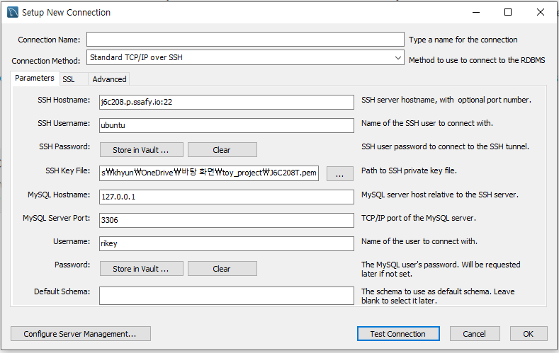

```
sudo apt-get update && sudo apt-get upgrade
```


```
sudo apt-get install openjdk-11-jdk
```


```
gradle 버전 설치 방법

https://codechacha.com/ko/installing-gradle/
```


```
sudo apt-get install mysql-server
```


```
sql 설정 관련

https://velog.io/@issac/AWS-EC2%EC%97%90-MySQL-%EC%84%9C%EB%B2%84-%EA%B5%AC%EC%B6%95%ED%95%98%EA%B8%B0
```


```
git clone
```


```
cd backend
```


```
gradle build
```


```
무중단 배포

nohup java -jar build/libs/(jar파일이름) --server.servlet.context-path=/api &
```



